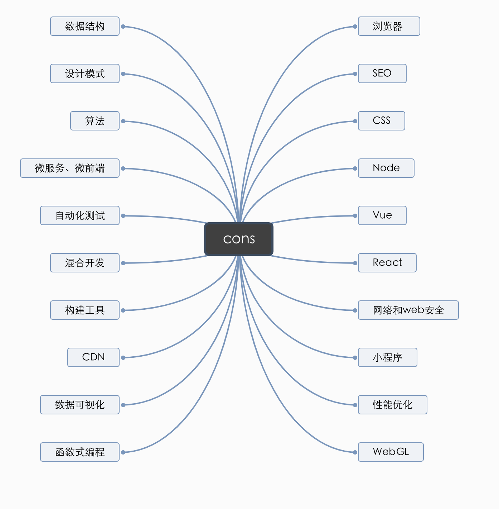

#### 前端知识体系

- [浏览器](./cons/bower.md)
- [SEO](./cons/seo.md)
- [CSS](./cons/css.md)
- [Node](./cons/node.md)
- [Vue](./cons/vue.md)
- [React](./cons/react.md)
- [网络与web安全](./cons/network_security.md)
- [小程序](./cons/mp.md)
- [性能优化](./cons/optimize.md)
- [WebGL](./cons/webGL.md)
- [函数式编程](./cons/fn_program.md)
- [数据可视化](./cons/data_show.md)
- [CDN](./cons/CDN.md)
- [构建工具](./cons/pack.md)
- [混合开发](./cons/mix_develop.md)
- [自动化测试](./cons/auto_qa.md)
- [微服务、微前端](./cons/macroserver_macrofrontend.md)
- [算法](./cons/calc_method.md)
- [设计模式](./cons/design_mode.md)
- [数据结构](./cons/data_cons.md)

#### [**问题**](./question/overview.md)

